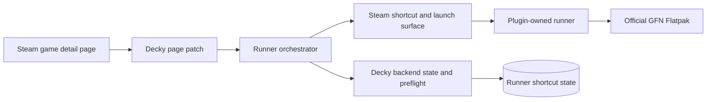
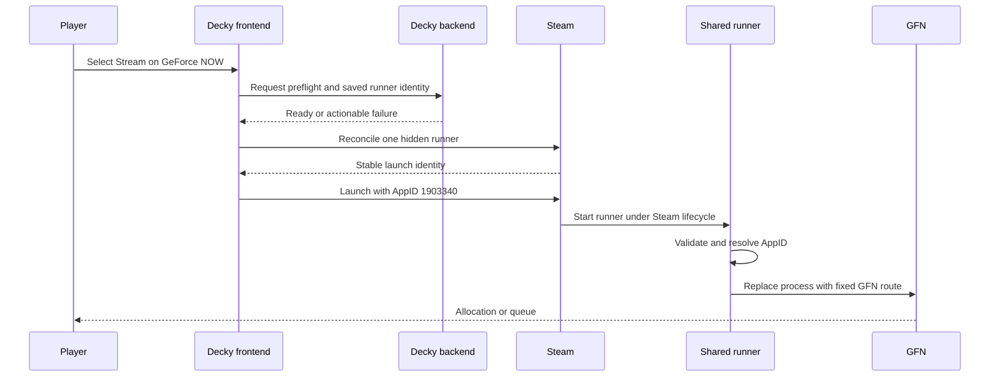
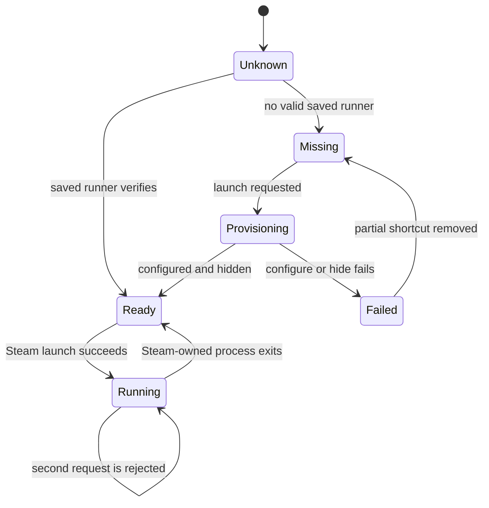
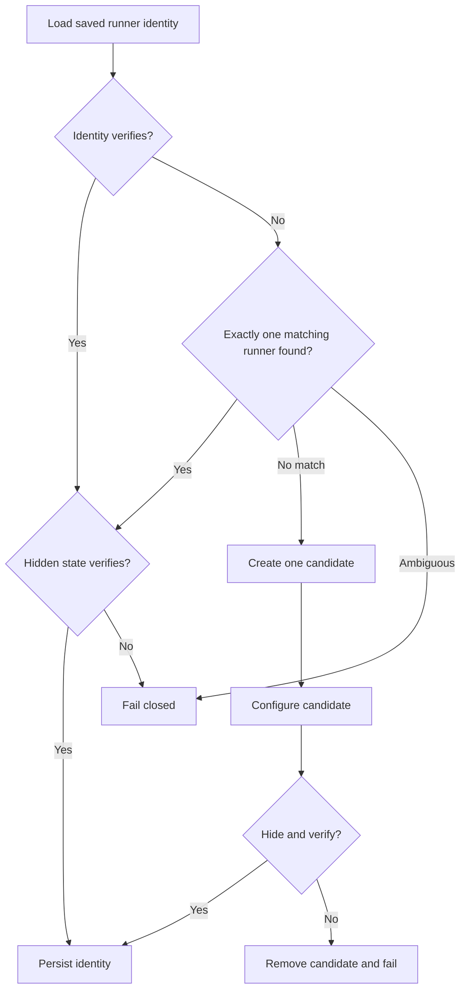
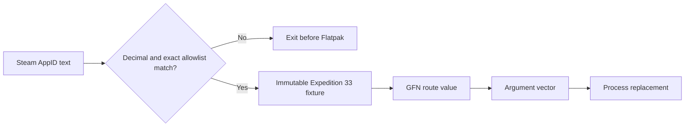
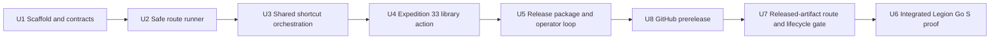

# Expedition 33 One-Tap GFN Device Proof - Plan

## Goal Capsule

- **Objective:** Publish a browser-downloadable Decky prerelease that lets the user start *Clair Obscur: Expedition 33* in GeForce NOW from its normal Steam page with one action while Steam retains input and process lifecycle control.
- **Means:** A Decky action launches one plugin-owned hidden Steam runner with AppID `1903340`; the runner maps that value to a fixed, validated GFN route. (KTD2, KTD3, KTD5)
- **Product authority:** This plan owns the single-title alpha, its GitHub prerelease, and the subsequent device proof. Catalog-backed multi-title support and stable promotion remain surrounding work.
- **Execution profile:** Build the strict runner, hidden-runner orchestration, and library action; publish an explicitly unvalidated prerelease; then install that exact artifact on the Legion Go S and record the device proof.
- **Stop conditions:** Stop before launch if GFN is not installed, the target is unsupported, the hidden runner cannot be reconciled without duplication, or a session already owns the runner.
- **Tail ownership:** The implementing workflow owns code, tests, the release archive and checksum, an open pull request, a public GitHub prerelease, device-proof instructions, and recorded verification evidence. It does not claim hardware validation without Legion Go S evidence.

---

## Product Contract

### Summary

Add a Stream on GeForce NOW action to Expedition 33's existing Steam page. The action uses one shared hidden Steam runner to cold-start the official GFN client and enter allocation or queueing without a second Play action.

### Problem Frame

Today the user must open NVIDIA GeForce NOW from the Steam library, navigate NVIDIA's library to Expedition 33, and launch it there. Steam already presents the game where the user decides what to play, but it offers no direct path into the GFN session. The proof must remove the duplicate browse-and-launch sequence without sacrificing Gaming Mode focus, controls, overlay access, or Exit Game behavior.

### Key Decisions

- **Ship the complete single-title plugin as an unvalidated prerelease before device proof.** (session-settled: user-directed — chosen over holding implementation and distribution behind manual hardware gates: make the exact installable artifact available from the Legion browser) Governs R1-R15.
- **Require one-tap session launch.** (session-settled: user-directed — chosen over a GFN details-page handoff: eliminate the second navigation and Play action) Governs R2, R6.
- **Keep one shared hidden runner.** (session-settled: user-directed — chosen over one hidden shortcut per title: keep the shortcut footprint constant as title support grows) Governs R3, R4, R5, R11, R12.
- **Use one shared GFN controller profile.** (session-settled: user-approved — chosen over per-title Steam Input profiles: avoid shortcut sprawl in the proof) Governs R8.
- **Hard-code the proof target.** Expedition 33 is the only recognized title until the device path passes. Governs R4, R5.

### How This Work Fits Together

This plan owns the Expedition 33 device proof. These areas are surrounding-work hypotheses, not a committed roadmap.

- **Catalog-backed multi-title support:** Depends on this proof and shares its single-runner AppID input contract.
- **Production resilience and user guidance:** Depends on observed failure modes of the official GFN client and Steam lifecycle on the target device.
- **Per-title input customization:** Can proceed independently later only if it preserves R3's constant shortcut footprint.

### Actors

- A1. **Legion Go S player:** Chooses between the existing Steam action and streaming Expedition 33 through GFN from Gaming Mode.
- A2. **Steam and Decky integration:** Presents the Stream action and owns the shared runner's launch lifecycle.
- A3. **Official GeForce NOW client:** Accepts the title route and performs authentication, allocation, queueing, and streaming.

### Requirements

#### Steam page experience

- R1. Expedition 33's normal Steam detail page for AppID `1903340` presents a distinct Stream on GeForce NOW action without replacing or changing Steam's native action.
- R2. One activation of the Stream action initiates the GFN launch flow without requiring the user to browse NVIDIA's library or press Play again.

#### Shared runner boundary

- R3. The plugin maintains at most one plugin-owned hidden Steam runner regardless of how many titles may be supported later.
- R4. Each launch supplies only the selected Steam AppID to the shared runner, and the runner rejects unrecognized input instead of accepting arbitrary commands or raw routes.
- R5. For this proof, AppID `1903340` resolves to the validated Expedition 33 GFN route and no other AppID is supported.

#### Cold launch and Steam lifecycle

- R6. With GFN fully stopped, the Stream action cold-starts the official client and reaches Expedition 33's allocation or queue without another user action.
- R7. Gamescope focuses the GFN client after Steam launches the shared runner.
- R8. The Legion Go S controls operate through one shared GFN Steam Input profile.
- R9. Steam's overlay is available while GFN is running.
- R10. Steam's Exit Game action ends the shared runner and the GFN process it owns.
- R11. The plugin-owned shared runner remains hidden from the normal Steam library.
- R12. Repeated launches reuse the existing runner without creating additional shortcuts.

#### Browser-downloadable prerelease

- R13. The repository publishes a non-draft GitHub prerelease whose release page and Decky ZIP are directly reachable from a browser.
- R14. The prerelease exposes the exact ZIP SHA-256, tag, and commit identity and labels the build as unvalidated on the Legion Go S; it is not marked latest or stable.
- R15. The ZIP contains one top-level `stream-gfn/` directory with only the Decky runtime, package metadata, executable runner, license, installation README, and build identity; corrections publish a new version rather than overwriting an existing asset.

### Key Flows

- F1. **Cold-start Expedition 33 from its Steam page.** A1 selects Stream on GeForce NOW while GFN is stopped; A2 launches the shared runner with AppID `1903340`; the runner validates and resolves the target; A3 enters allocation or queueing. Covers R1-R6.
- F2. **Use and exit the Steam-owned GFN session.** Gamescope focuses GFN; the shared controller profile handles input; A1 can open the Steam overlay and invoke Exit Game. Covers R7-R10.
- F3. **Reuse the runner.** A1 launches again after a completed exit; A2 reconciles and reuses the same hidden runner with AppID `1903340`. Covers R3-R5, R11, R12.
- F4. **Download and install the exact prerelease.** A1 opens the GitHub release page in a browser, downloads the Decky ZIP and checksum, installs the packaged `stream-gfn/` directory, and can identify the installed tag and commit before device proof. Covers R13-R15.

### Acceptance Examples

- AE1. **Cold one-tap launch.** Given GFN is installed, authenticated, and stopped on the Legion Go S, when the user selects Stream on GeForce NOW from Expedition 33's Steam page, then GFN reaches allocation or queue without another Play action. Covers R1, R2, R5, R6.
- AE2. **Steam-owned lifecycle.** Given Expedition 33 was launched through the shared runner, when the user operates the built-in controls, opens the Steam overlay, and selects Exit Game, then input works, the overlay appears, and Steam terminates the runner and its owned GFN process. Covers R7-R10.
- AE3. **Constant shortcut footprint.** Given the hidden runner exists, when the user launches Expedition 33 again, then the same runner is reused, the plugin-owned shortcut count remains one, and no visible duplicate appears. Covers R3, R11, R12.
- AE4. **Reject an unsupported target.** Given the runner receives an AppID other than `1903340`, when launch is attempted, then it exits before Flatpak without treating the input as a command or launching another title. Covers R4, R5.
- AE5. **Browser-delivered identity.** Given the published prerelease page, when the user downloads the ZIP and checksum, then the digest matches, the archive contains the exact allowlisted runtime tree, and the installed plugin reports the published tag and commit. Covers R13-R15.

### Success Criteria

- AE1-AE3 pass twice in succession from Gaming Mode on the Legion Go S.
- AE4 passes once before the proof is accepted.
- The second run reuses the same hidden shortcut and produces the same one-tap result as the first.
- The public prerelease page exposes an installable ZIP and matching checksum before device validation begins.
- The proof produces an unambiguous go or no-go decision for stable promotion and catalog-backed title expansion without requiring catalog work to reach that decision.

### Scope Boundaries

#### Deferred for later

- NVIDIA catalog discovery, caching, refresh, and support for titles beyond Expedition 33.
- GFN installation, authentication recovery, concurrent-session handling, and production fallback behavior.
- Automatic detection of remote game completion, automatic background client shutdown, Decky plugin-store submission, and stable release promotion.
- Per-title Steam Input profiles that preserve R3's constant shortcut footprint.

#### Outside this product's identity

- Creating one hidden Steam shortcut per supported title.
- Creating visible duplicate GFN entries for games already represented in the Steam library.

### Dependencies

- The target Legion Go S has Decky Loader and NVIDIA's official `com.nvidia.geforcenow` Flatpak installed and authenticated.
- The development host is macOS, so Gamescope, Steam Input, overlay, and Exit Game evidence must come from the Legion Go S.
- Steam and GFN expose undocumented compatibility surfaces. The implementation must version-gate them and fail closed when they are absent.

### Sources and Research

- [`README.md`](../../README.md) — current repository product statement.
- [Decky Loader plugin template](https://github.com/SteamDeckHomebrew/decky-plugin-template) — current package, build, lifecycle, and frontend/backend conventions.
- [Decky frontend Steam client types](https://github.com/SteamDeckHomebrew/decky-frontend-lib/tree/main/src/globals/steam-client) — shortcut creation and launch surface.
- [Klay at `70a37ed`](https://github.com/gshipley/Klay/tree/70a37ed36230d24146534d9bfbc02fb06e2adadf) — current GFN catalog query and native route construction.
- [MoonDeck at `4d1021b`](https://github.com/FrogTheFrog/moondeck/tree/4d1021b4f7afe930e8025e25471af40aab1d73a1) — adjacent Steam shortcut reconciliation, hidden-state verification, launch, and library-page patch patterns.
- [GitHub CLI release creation](https://cli.github.com/manual/gh_release_create) — prerelease flags, target commit selection, release notes, and asset upload behavior.
- NVIDIA's public GFN catalog response observed on 2026-08-29 — Expedition 33 Steam variant: CMS ID `103134919`, parent game ID `037a263a-adbf-4705-8509-76447080de75`, fallback short name `game_gfn_pc`.

---

## Planning Contract

### Product Contract Preservation

The earlier proof-first sequencing decision changed at the user's direction. R1-R12, F1-F3, and AE1-AE4 remain stable; R13-R15, F4, and AE5 add the explicitly unvalidated GitHub distribution needed to perform the proof from the Legion Go S.

### Key Technical Decisions

- KTD1. Use the current Decky TypeScript/React frontend and Python backend shape with `@decky/api`, `@decky/ui`, and `@decky/rollup`; do not use deprecated Decky APIs. This supplies a buildable greenfield baseline for R1-R12.
- KTD2. Steam launches the plugin-owned runner, and the runner replaces itself with the Flatpak process. The backend never launches GFN on behalf of the frontend. This preserves Steam's process ownership for R6-R10.
- KTD3. Store the Expedition 33 route as typed, immutable metadata and construct the Flatpak argument vector without shell parsing. The observed route is `#?cmsId=103134919&launchSource=External&shortName=game_gfn_pc&parentGameId=037a263a-adbf-4705-8509-76447080de75`. Accept exactly one decimal AppID and reject every unrecognized value before process launch. This implements R4 and R5.
- KTD4. Reconcile the runner through a narrow private-Steam adapter. Ownership requires an exact unique fingerprint of plugin-owned executable path, start directory, display name, and empty stored launch options. Create only when absent, verify hidden state, and remove only a candidate created and reverified during the current attempt. This implements R3, R11, and R12. (session-settled: user-directed — chosen over creating one shortcut per title: keep the shortcut footprint constant as support grows)
- KTD5. Keep the shortcut's stored launch options empty and supply AppID `1903340` through Steam's per-launch argument field. Do not rewrite shortcut options for each click. This implements R3-R5 and R12. (session-settled: user-directed — chosen over title-specific shortcut launch options: preserve a single reusable runner)
- KTD6. Patch only the `/library/app/:appid` surface, require an exact `1903340` match, guard all private React-tree lookups, and remove the patch during plugin dismount. This contains the compatibility risk for R1 and R2.
- KTD7. Model runner activity as `inactive`, `active`, or `unknown`. U3 maps exact `ReadyToLaunch` to inactive and `Launching`, `Running`, or `Terminating` to active, then combines that snapshot with runner-scoped Steam lifetime notifications. Missing, unrecognized, failed, or timed-out state is unknown. Only inactive may launch; U7 validates the provisional mapping on hardware.
- KTD8. Make the backend the sole persistence authority. Persist only the reconciled runner shortcut ID as a string and its schema version in Decky's settings directory. Do not persist fingerprints, raw routes, executable arguments, or commands. This supports deterministic reuse under R3, R4, and R12.
- KTD9. Keep `targetSteamAppId`, persisted `runnerShortcutId`, and `runnerGameId64` as distinct string-valued concepts. Validate and convert the shortcut ID to a safe uint32 number only inside the private-Steam adapter when a Steam shortcut API requires it. Resolve the 64-bit launch identity from Steam's verified overview and always keep that game ID opaque and string-valued. This prevents cross-identity mutation while implementing R3-R5 and R12.
- KTD10. Package version `0.1.0-alpha.1` as `stream-gfn-v0.1.0-alpha.1.zip`, always with the stable inner directory `stream-gfn/`, plus a sibling `.sha256` file. The release title and notes state `UNVALIDATED DEVICE BUILD`, and GitHub receives `--prerelease --latest=false`.
- KTD11. Put an explicit `Remove hidden runner` action in the Decky plugin panel. The panel shows the verified runner identity and activity, requires confirmation, disables cleanup for active or unknown state, and reports success, no-owned-runner, and failure outcomes. Cleanup removes only an exactly reverified plugin-owned shortcut, waits for Steam to confirm absence, and only then clears saved state. Plugin dismount removes patches and listeners but never silently deletes the reusable runner.

### Assumptions

These bets were not validated in the planning environment and remain explicit device gates.

- The installed GFN Flatpak accepts the observed route fields and enters allocation or queueing when cold-started.
- Steam's current Gaming Mode runtime exposes shortcut creation, per-launch arguments, library overview lookup, hidden collection state, and launch source `100` in the shapes observed in current Decky and MoonDeck sources.
- Replacing the runner process with Flatpak keeps GFN inside Steam's lifecycle boundary so overlay and Exit Game work as R9 and R10 require.
- One shared Steam Input profile on the runner supplies usable built-in controls to GFN.

### System-Wide Impact

- **Steam library state:** U3 may create one non-Steam shortcut. It may mutate or remove only a shortcut whose full plugin fingerprint proves ownership under KTD4.
- **Decky lifecycle:** U4 installs a private route patch and must remove it on unload or any compatibility failure so the native Steam page remains usable.
- **Process lifecycle:** KTD2 makes Steam the session owner. A detached or surviving GFN process invalidates the mechanism and stops later units.
- **Persistent state:** KTD8 limits durable state to a schema version and runner shortcut ID. Reconciliation treats missing, malformed, stale, and ambiguous state as distinct fail-closed outcomes.
- **Compatibility surface:** Route fields, private Steam state, and GFN process behavior are bound to the version tuple captured at each device gate.

### Risks and Mitigations

| Risk | Earliest gate | Mitigation and stop signal |
|---|---|---|
| The route fixture opens the wrong title or no title | U7 released-artifact gate | Label the prerelease `NO-GO / DO NOT USE`, retain the evidence, and stop stable promotion and catalog expansion |
| Flatpak detaches from Steam's process lifecycle | U7 released-artifact gate | Require Steam running-state clearance and no remaining GFN process after Exit Game; keep the build prerelease-only on failure |
| Private Steam APIs drift or hiding cannot be verified | U3 host tests and U7 released-artifact gate | Feature-detect exact capabilities, preserve the pre-run inventory, roll back only the current verified candidate, and leave the native Steam page usable |
| Shortcut identity types are confused | U3 automated and device tests | Enforce KTD9, persist strings, and compare the same opaque shortcut and 64-bit game identities before both launches |
| Page injection breaks the native library page | U4 tests and U6 final gate | Guard tree matching, cleanly unpatch, and unload the plugin during no-go cleanup |
| GFN account data leaks into evidence | U6 evidence review | Store only sanitized screenshots and logs; exclude credentials, tokens, and account identifiers |

### High-Level Technical Design

These sketches constrain boundaries and sequencing. Exact APIs and component names may change during implementation if the behavior and gates remain intact.

#### Component topology



#### Cold-launch sequence



#### Runner lifecycle



#### Reconciliation decision flow



#### Launch data boundary



### Output Structure

```text
.
├── .github/workflows/ci.yml
├── backend/
│   ├── __init__.py
│   ├── launcher.py
│   └── settings.py
├── bin/gfn-launch
├── docs/
│   ├── device-proof.md
│   ├── releases/v0.1.0-alpha.1.md
│   └── plans/2026-08-29-2303-feat-expedition-33-gfn-device-proof-plan.md
├── scripts/build_release.py
├── main.py
├── src/
│   ├── api.ts
│   ├── index.tsx
│   ├── components/
│   │   ├── GfnLaunchButton.test.tsx
│   │   ├── GfnLaunchButton.tsx
│   │   ├── PluginPanel.test.tsx
│   │   └── PluginPanel.tsx
│   ├── library/
│   │   ├── patchLibraryApp.test.tsx
│   │   └── patchLibraryApp.tsx
│   └── steam/
│       ├── privateSteam.ts
│       ├── runnerShortcut.test.ts
│       ├── runnerShortcut.ts
│       ├── runnerState.test.ts
│       └── runnerState.ts
├── tests/
│   ├── backend/
│   │   ├── test_launcher.py
│   │   ├── test_lifecycle.py
│   │   └── test_settings.py
│   └── frontend/scaffold.test.mjs
├── LICENSE
├── package.json
├── pnpm-lock.yaml
├── plugin.json
├── rollup.config.js
└── tsconfig.json
```

### Implementation Constraints

- The plugin must run without root privileges.
- The backend may accept a supported AppID but must not accept executable paths, shell fragments, arbitrary Flatpak flags, or raw GFN routes from the frontend.
- The runner executable path and working directory must be absolute and plugin-owned.
- A newly created shortcut is not persistent state until its Steam overview, configuration, and hidden state all verify.
- Private Steam access must be feature-detected and isolated so a loader or Steam update produces an actionable error instead of a visible duplicate or a crash.
- The GFN route fixture must include its observation date and source metadata because the route is undocumented.
- The UI must not advertise a successful start until Steam accepts the runner launch.

### Sequencing



---

## Implementation Units

### U1. Establish the Decky plugin scaffold and executable contracts

- **Status:** Completed baseline in commit `e280773`; preserve and extend it rather than recreating it.
- **Goal:** Create the smallest current Decky project that builds deterministically and gives backend, frontend, and tests stable boundaries.
- **Requirements:** R1-R12.
- **Dependencies:** None.
- **Files:** `package.json`, `pnpm-lock.yaml`, `plugin.json`, `rollup.config.js`, `tsconfig.json`, `main.py`, `backend/__init__.py`, `src/index.tsx`, `tests/frontend/scaffold.test.mjs`, `tests/backend/test_lifecycle.py`, `.github/workflows/ci.yml`.
- **Approach:** Pin the current Decky packages from KTD1, register a minimal plugin lifecycle, expose typed backend callables, and define build, typecheck, frontend-test, backend-test, and aggregate verification scripts. Keep the initial UI inert until U4.
- **Test scenarios:** A production build emits `dist/index.js`; TypeScript compilation succeeds without deprecated Decky imports; the backend loads and unloads without writing outside Decky's assigned directories; CI runs the same aggregate checks as local development.
- **Verification:** `pnpm install --frozen-lockfile`, `pnpm run typecheck`, `pnpm run build`, and `pnpm test` succeed on the development host.

### U2. Build the strict Expedition 33 route runner

- **Status:** The strict launcher, wrapper, state schema, and core tests are completed baseline in commit `2034c60`; this unit now owns only the missing backend RPC and persistence work.
- **Goal:** Preserve the strict AppID-to-route runner while completing fixed-shape backend preflight, plugin-path, settings, and build-identity RPCs.
- **Requirements:** R4-R6, AE1, AE4.
- **Dependencies:** U1.
- **Files:** `main.py`, `backend/launcher.py`, `backend/settings.py`, `bin/gfn-launch`, `tests/backend/test_launcher.py`, `tests/backend/test_lifecycle.py`, `tests/backend/test_settings.py`.
- **Approach:** Preserve KTD2 and KTD3. Complete KTD8 with atomic same-directory settings writes and fixed-shape RPCs for resolved plugin paths, GFN preflight, state load/save, and read-only build identity. Preflight uses a bounded no-shell `flatpak info com.nvidia.geforcenow` call and reports missing executable, missing app, timeout, malformed response, and ready outcomes without accepting client-supplied commands or paths. If U7 finds a target-specific environment conflict, create a new alpha correction unit and version, rerun affected host gates and U5/U8, and repeat U7; never mutate the released asset in place.
- **Test scenarios:** Existing strict route tests remain green; backend paths resolve inside the plugin root; preflight covers missing executable, missing app, timeout, error, and success; settings round-trip a valid shortcut ID atomically and discard malformed or unknown-schema state; build identity is read-only and rejects malformed packaged metadata.
- **Verification:** `pnpm run backend-test` passes, `bin/gfn-launch 0` exits non-zero without invoking Flatpak in a mocked harness, and the staged runner retains executable permissions.

### U7. Prove the released artifact's direct route and Steam lifecycle on device

- **Goal:** Falsify the route and process-lifecycle assumptions using the exact published prerelease before any stable promotion.
- **Requirements:** R5-R10, R13-R15, F1, F2, F4, AE1, AE2, AE5.
- **Dependencies:** U8.
- **Files:** `docs/device-proof.md` and sanitized evidence under `docs/device-proof-results/`.
- **Execution note:** This is a stable-promotion gate, not an implementation or prerelease-publication gate. A `NO-GO` updates the prerelease warning and stops U6, stable promotion, and catalog expansion.
- **Approach:** Open the release page in the Legion browser, download and verify the ZIP, install its `stream-gfn/` directory, confirm the panel-displayed tag and commit, and capture the version tuple and pre-run process state. Use the packaged runner for the fixed-route diagnostic, close GFN, then require the process probe to report no matches on two consecutive 500-millisecond polls before using the plugin-owned hidden runner for Gamescope focus, controller input, overlay, Exit Game, cleared Steam state, and cleared GFN process checks. Do not create a separate manual shortcut.
- **Test scenarios:** The downloaded digest matches; installed identity matches the release; the direct runner opens Expedition 33 allocation or queue rather than GFN home; the inter-gate process reset proves a cold start; the plugin runner reports active and inactive states and maps errors to unknown; input, named controller action, overlay, and Exit Game work; no GFN process survives; failure records the invalidated KTD and final inventory.
- **Verification:** The U7 matrix records `GO` for both direct-route and plugin-runner lifecycle gates with sanitized evidence, or a reproducible `NO-GO` with cleanup and a corresponding prerelease warning update.

### U3. Reconcile and launch one hidden Steam runner

- **Goal:** Provision or recover exactly one hidden shortcut and launch it with a per-call AppID argument.
- **Requirements:** R3-R5, R11, R12, F3, AE3.
- **Dependencies:** U1, U2.
- **Files:** `src/api.ts`, `src/steam/privateSteam.ts`, `src/steam/runnerShortcut.ts`, `src/steam/runnerState.ts`, `src/steam/runnerShortcut.test.ts`, `src/steam/runnerState.test.ts`.
- **Approach:** Implement KTD4, KTD5, KTD7-KTD9 behind injected Steam and backend ports. Wait for Steam's app overview before treating a shortcut as usable. Verify hidden state through a feature-detected collection adapter. Refuse near-match or foreign shortcuts. Resolve Steam's launch identity from the verified overview and pass `1903340` only at launch time. Implement the verified removal operation that KTD11's panel action calls.
- **Test scenarios:** A fully fingerprinted saved runner is reused without creation; one exact recoverable runner repairs stale saved state; a name-only or partial match is left untouched; no runner creates, configures, hides, verifies, and persists one candidate; an ambiguous match fails without creation; hide or configure failure reverifies and removes only the current candidate; runner IDs round-trip as strings; the target primitive initializes inactive, active, and unknown states; lifetime events update only the matching runner; active and unknown requests do not call Steam launch; Steam receives the 64-bit runner launch identity and target AppID separately.
- **Verification:** Vitest runs through `pnpm run frontend-test -- src/steam` and exercises the injected Steam ports for exact ownership, rollback, hide verification, state mapping, separated launch identities, and verified cleanup. Device behavior is verified in U7 and U6.

### U4. Add the Expedition 33 library-page action

- **Goal:** Present a guarded one-tap action only on Expedition 33's normal Steam page and connect it to U3.
- **Requirements:** R1, R2, R6, F1, AE1.
- **Dependencies:** U3.
- **Files:** `src/index.tsx`, `src/components/GfnLaunchButton.tsx`, `src/components/PluginPanel.tsx`, `src/library/patchLibraryApp.tsx`, `src/library/patchLibraryApp.test.tsx`, `src/components/GfnLaunchButton.test.tsx`, `src/components/PluginPanel.test.tsx`.
- **Approach:** Implement KTD6 and KTD7. Patch the library-detail route on mount, locate the action area through guarded tree matching, inject one Decky-styled and controller-focusable action for exact AppID `1903340`, and remove the patch on dismount. Its accessible name follows the visible interaction-state label. Disable repeat activation while work is in flight, active, or unknown. The Decky panel shows build tag/commit, capability and runner status, a retry action for compatibility checks, and KTD11's confirmed cleanup action. Missing private surfaces leave the native page unchanged and persist a `Compatibility unavailable` panel state that names the missing capability and relevant versions.
- **Test scenarios:** The button appears once for AppID `1903340` and never for another or malformed AppID; the native action remains present; controller focus order, focus treatment, accessible name, and disabled semantics remain usable across states; one activation issues one launch request; rapid repeats issue one request; a late activation event after timeout leaves state active or unknown without a second launch; missing private surfaces omit the page action and render the persistent panel diagnostic; retry rechecks capabilities; build identity renders; cleanup confirmation covers active/unknown refusal, exact removal, no-owned-runner, success, and failure; dismount removes the route patch and listeners without deleting the runner.
- **Verification:** `pnpm run frontend-test -- src/library src/components` passes, `pnpm run typecheck` passes, and `pnpm run build` emits the frontend bundle.

#### U4 interaction states

| State | Stream action | Player guidance | Exit |
|---|---|---|---|
| Ready | Enabled; label `Stream on GeForce NOW` | None | Activation enters Starting |
| Starting | Disabled; label `Starting GeForce NOW…` | No success message until Steam reports the runner active | Explicit pre-launch rejection enters Launch failure; accepted launch that times out enters Unknown; runner start enters Active |
| Active | Disabled; label `GeForce NOW is running` | Use Steam's Exit Game action to end the current stream | Matching lifetime-end event returns to Ready |
| Preflight failure | Enabled after the failed attempt | State the missing prerequisite and invite retry after it is corrected | Dismiss returns to Ready |
| Runner failure | Enabled after rollback | State that the hidden runner could not be prepared; invite Steam restart and retry | Dismiss returns to Ready |
| Launch failure | Enabled only after explicit pre-launch rejection or cancellation | State that Steam did not accept the launch and invite retry | Dismiss returns to Ready |
| Unknown activity | Disabled | State that runner status cannot be verified; direct the player to Exit Game or restart Steam | A verified inactive snapshot returns to Ready |
| Compatibility unavailable | No page action | Panel names the missing capability, records Steam and Decky versions, and states that the native page was unchanged | Retry after Decky or Steam reload re-runs capability detection |

### U5. Assemble the release package and document the operator loop

- **Goal:** Produce the exact Decky ZIP, checksum, build identity, and browser-to-device installation loop used by the prerelease.
- **Requirements:** R1-R15 and AE1-AE5.
- **Dependencies:** U2, U3, U4.
- **Files:** `README.md`, `docs/device-proof.md`, `scripts/build_release.py`, `package.json`, `plugin.json`, `LICENSE`, and runtime files required by the current Decky template.
- **Approach:** Invoke one dependency-free Python standard-library packager through `pnpm run bundle:release`. Build from a clean exact commit into one top-level `stream-gfn/` directory. Allowlist `plugin.json`, `package.json`, `dist/index.js`, `main.py`, `backend/`, `bin/gfn-launch`, `README.md`, `LICENSE`, and generated build identity. Reject traversal and symlinks, preserve runner mode `0755`, exclude source maps, source, tests, caches, dependencies, credentials, and evidence, then emit the versioned ZIP and SHA-256. Document the primary handheld journey through browser download, checksum verification, Desktop Mode extraction into Decky's local plugin directory, Decky reload, return to Gaming Mode, and panel build-identity confirmation, plus clean-install, upgrade, failed-reload, cleanup, and uninstall branches.
- **Test scenarios:** A clean checkout produces a deterministic runtime inventory; extracted backend import succeeds; runner is executable; metadata reports the expected tag and commit; archive contains no duplicate root, symlink, traversal, or excluded file; install and cleanup instructions preserve unrelated shortcuts.
- **Verification:** `pnpm run bundle:release` succeeds, archive inventory matches the allowlist, extracted smoke tests pass, and recomputing SHA-256 matches the sibling file.

### U8. Publish the GitHub prerelease

- **Goal:** Put the exact testable plugin artifact on a public browser-accessible GitHub release page.
- **Requirements:** R13-R15, F4, AE5.
- **Dependencies:** U5 and a green pull-request branch verification run.
- **Files:** `docs/releases/v0.1.0-alpha.1.md` and generated release assets outside the tracked source tree.
- **Approach:** Commit and push the implementation, open the pull request, wait for green CI, tag the exact verified commit as `v0.1.0-alpha.1`, then create a non-draft prerelease with `--prerelease --latest=false`. Upload `stream-gfn-v0.1.0-alpha.1.zip` and its `.sha256`. The title and first release-note paragraph say `UNVALIDATED DEVICE BUILD`; notes link the proof checklist and state that browser download is transport, not automatic Decky installation. Never overwrite this version's ZIP.
- **Test scenarios:** Release page is public; tag resolves to the intended commit; both named assets are downloadable; downloaded checksum matches; archive identity matches tag and commit; release is prerelease and not latest.
- **Verification:** GitHub release inspection and a fresh asset download reproduce AE5 before the user is handed the URL.

### U6. Execute and record the Legion Go S device proof

- **Goal:** Determine whether the single-runner architecture satisfies the user-visible proof on the target hardware.
- **Requirements:** R1-R12, F1-F3, AE1-AE4.
- **Dependencies:** U7.
- **Files:** `docs/device-proof.md` and device evidence under `docs/device-proof-results/` when the target is available.
- **Execution note:** This unit is an on-device acceptance gate. Development-host substitutes cannot prove Gamescope focus, Steam Input, overlay, hidden-library state, or Steam-owned termination.
- **Approach:** Capture the native Steam page, shortcut inventory, runner fingerprint, opaque identities, stored launch options, and process state before installation. Confirm U7 and U3 gate evidence still matches the installed versions. Run AE4, then run two complete AE1-AE3 cycles from fully stopped GFN. After each exit, record Steam running state, GFN processes, runner count, hidden state, launch options, and page usability. On failure, unload the page patch, stop the owned processes, and remove only a newly created runner whose ownership still verifies.
- **Test scenarios:** Unsupported AppID fails before Flatpak; the cold action reaches a title-identifying Expedition 33 allocation or queue without a second action; GFN receives foreground input without desktop fallback; a named built-in controller action responds; the Steam overlay opens and closes over GFN; Exit Game clears Steam's running state and leaves no GFN process after the recorded interval; the original game page remains usable; the second cycle launches the same hidden shortcut with exactly one argument `1903340`, empty stored launch options, and no shortcut mutation; every failure ends in the documented safe inventory and process state.
- **Verification:** The completed matrix links sanitized evidence for every AE and reports one `GO` or `NO-GO` conclusion. `GO` requires AE1-AE3 twice and AE4 once. `NO-GO` requires a reproducible failure record and completed cleanup.

---

## Verification Contract

### Development-host gates

- `pnpm install --frozen-lockfile` proves the lockfile resolves without mutation.
- `pnpm run typecheck` proves the Decky frontend and private adapter types compile.
- `pnpm run frontend-test` runs Vitest with a DOM-capable React environment and proves page gating, controller/accessibility semantics, panel states, runner reconciliation, launch arguments, rollback, cleanup, and reentrancy behavior under mocked Steam surfaces.
- `pnpm run backend-test` proves strict AppID validation, fixed route construction, safe process arguments, preflight, atomic settings, plugin paths, and packaged build identity behavior.
- `pnpm run build` proves the loader frontend bundle is emitted.
- `pnpm run bundle:release` proves the versioned Decky ZIP contains only the documented runtime files, preserves executable mode, passes extracted imports, and emits a matching checksum.
- `pnpm run verify` is the aggregate local and CI gate and must run typecheck, frontend tests, backend tests, build, and release-bundle verification.

### Release gates

- The tag resolves to the exact locally and in-CI verified commit.
- The GitHub release is non-draft, prerelease, and not latest; its title and first paragraph say `UNVALIDATED DEVICE BUILD`.
- A fresh browser-style download of both assets reproduces the published SHA-256 and embedded tag/commit identity.
- The release page explains manual Decky installation and links the U7/U6 proof checklist.

### Legion Go S gates

| Gate | Preconditions | Action | Done signal |
|---|---|---|---|
| Release download | Published prerelease page open in the Legion browser | Download ZIP and checksum, verify digest, install `stream-gfn/` | Installed tag and commit match the release and plugin loads |
| Direct route | Released plugin installed; GFN authenticated and stopped | Run U7 packaged-runner route check | Expedition 33 is identified on allocation or queue; a generic GFN screen is insufficient |
| Cold-process reset | Direct route passed | Close GFN and poll every 500 ms | Existing process probe reports no matches twice consecutively before plugin launch |
| Plugin Steam lifecycle | Cold-process reset passed; plugin-owned runner fingerprint recorded | Run U7 lifecycle check through the plugin | GFN takes foreground input; named controller action and overlay work; Exit Game clears Steam running state and GFN processes |
| Private API capability | Released plugin installed; target versions recorded | Exercise the exact page, shortcut, overview, hidden-state, launch, and active-run surfaces used by U3 | Every surface is present in the expected shape; any mismatch fails closed without native-page or foreign-shortcut mutation |
| Automatic runner | Released prerelease installed | Launch twice through the normal Stream on GeForce NOW action after complete exits | Same hidden fingerprint and opaque identities; one argument `1903340`; empty stored launch options; runner count one |
| Unsupported target | GFN stopped; test harness invokes runner with a non-allowlisted value | Run AE4 once | Non-zero exit; no GFN process; diagnostic names unsupported AppID |
| Cold one-tap launch | GFN authenticated and fully stopped | Run AE1 from Expedition 33 page | Title-identifying Expedition 33 allocation or queue appears without another action |
| Gaming Mode lifecycle | Session started through the runner | Run AE2 | Foreground input, named controller action, and overlay pass; Exit Game clears Steam running state and GFN processes |
| Constant footprint | First run exited; runner identity recorded | Run AE3 and repeat AE1-AE3 | Same fingerprint and identities; one hidden runner; empty stored options; no visible duplicate or per-click mutation |

### Evidence rules

- Give each dated record an operator or evidence owner.
- Record the Decky Loader, Steam client, SteamOS, GFN Flatpak, and plugin commit versions.
- Record the runner fingerprint, opaque shortcut and game identities, route-fixture observation date, and stored launch options without account data.
- Record before and after runner count, hidden state, Steam running state, GFN process state, and native page usability.
- Record pass or fail for each observable step and link a supporting sanitized screenshot or log.
- Sanitize screenshots and logs so NVIDIA account data, tokens, and device credentials are absent.
- A development-host pass does not waive any Legion Go S gate.
- Browser automation does not prove the Gaming Mode UI, but U8 must verify that the public release page and both assets are reachable and consistent.

### Lifecycle Observation Rule

- Start the observation clock when the player confirms Steam's Exit Game action.
- Poll every 500 milliseconds for up to 10 seconds.
- Steam is clear only when the runner-scoped lifetime state is not running.
- GFN is clear only when `/usr/bin/pgrep -af 'com.nvidia.geforcenow|/app/cef/GeForceNOW'` returns no matching process.
- Record `GO` only after both probes are clear on two consecutive polls. Timeout or an unavailable probe is `NO-GO`.

### No-Go Cleanup

- Stop any Steam-owned runner and confirm both lifecycle probes clear under the Lifecycle Observation Rule.
- Restore the native page by unloading the plugin patch.
- Remove only a shortcut created by this proof whose full ownership fingerprint still verifies.
- Restore the pre-existing verified runner state or clear persisted state when no owned runner remains.
- Record the failing assumption, phase, version tuple, and final shortcut inventory and process state.

---

## Definition of Done

- U1 is done when a clean checkout installs, typechecks, tests, builds, and produces `dist/index.js` through pinned commands.
- U2 is done when only AppID `1903340` can reach the fixed route and every invalid input exits before Flatpak.
- U3 is done when mocked tests prove exact fingerprint ownership, opaque-ID separation, create, recover, reuse, hide verification, rollback, active/unknown rejection, per-launch argument delivery, empty stored options, explicit cleanup, and constant shortcut count.
- U4 is done when the guarded action appears only on Expedition 33, preserves the native action, launches once per activation, and cleans up on dismount.
- U5 is done when the versioned runtime ZIP, checksum, extracted smoke test, and browser-to-device runbook are reproducible from a clean exact commit.
- U8 is done when the public GitHub prerelease points at the verified commit, exposes both matching assets, is clearly unvalidated, and is not marked latest.
- U7 is done when the downloaded prerelease's route and plugin-runner lifecycle gates record `GO`, or a reproducible `NO-GO` with cleanup and a release warning update that stops U6 and stable promotion.
- U6 is done when the Legion Go S matrix records AE1-AE3 passing twice and AE4 passing once, or records a reproducible `NO-GO` that identifies the invalidated assumption and completes no-go cleanup.
- R1-R15 each trace to an implementation unit and a verification gate.
- The repository contains no credentials, account data, build caches, dead-end experiments, duplicate runner logic, or abandoned implementation paths.
- The final diff preserves the requirements-only Product Contract's meaning and stable IDs.
